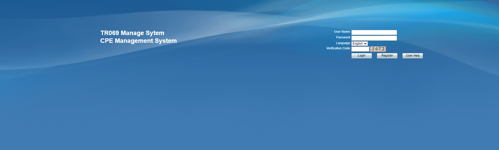

# QuecPython-TR069-CWMP User Guide

This document mainly describes the usage of TR069 and QuecPython.


## Overview

TR-069 is a protocol used for remote management and configuration of devices, typically used by Internet Service Providers (ISPs) to manage devices provided to customers, such as routers, modems, and optical network terminals. Here are the main features and instructions for use of TR-069:

1. **Device Configuration**: Initially, the device needs to know the URL, username, and password of the Auto Configuration Server (ACS) in order to connect to the ACS. This information is usually provided by the ISP.
2. **Remote Management**: The ACS can remotely manage devices, including configuration changes, firmware upgrades, and device reboots. These operations can be performed through TR-069 communication with the device.
3. **Parameter Query**: The ACS can query the device's configuration parameters and status information. This helps monitor device performance, troubleshoot, and diagnose faults.
4. **Regular Connection**: Devices typically connect to the ACS regularly to check for new configurations or instructions. This is usually achieved by periodically sending heartbeat signals or performing scheduled ACS requests.
5. **Security**: TR-069 supports secure communication, typically using the HTTPS protocol to protect data transmission between the ACS and devices. Communication between the device and ACS can be authenticated using a username and password to ensure security.
6. **Event Notification**: Devices can send event notifications to the ACS, such as error reports, alerts, and status changes. The ACS can subscribe to these events to take appropriate actions in a timely manner.
7. **Configuration Profiles**: The ACS can send configuration profiles to devices so that devices can automatically perform corresponding settings. This includes network settings, port mapping, firewall rules, etc.
8. **Device Identification**: The TR-069 protocol uses a Customer Premises Equipment (CPE) identifier to uniquely identify devices, usually the device's serial number or other unique identifier.

Overall, the TR-069 protocol provides a standardized way to remotely manage and configure devices, enabling ISPs to more easily manage a large number of devices while also providing better service and support to end-users. Using TR-069 requires proper configuration and communication between the device and ACS to ensure normal operation.

## Components

TR-069 (Technical Report 069) is a protocol that includes multiple components, defining a framework and specifications for remote management and configuration of devices. Here are some of the main components of TR-069:

1. **CPE (Customer Premises Equipment)**: CPE refers to devices located at the customer's premises or home, such as routers, modems, and optical network terminals. CPE is the object of management in TR-069, meaning the devices that need remote management and configuration.
2. **ACS (Auto Configuration Server)**: The ACS is the server-side component of TR-069, typically hosted by the Internet Service Provider (ISP) or device manufacturer. The ACS is used for remote management of CPE, including configuration, upgrades, monitoring, and troubleshooting.
3. **CWMP (CPE WAN Management Protocol)**: CWMP is the communication protocol within the TR-069 protocol, defining the communication specifications between CPE and ACS. It stipulates the details of message format, method calls, notifications, and data models.
4. **Data Model**: TR-069 defines a set of data models used to describe the parameters and configuration of CPE. These data models organize the information of devices, allowing the ACS to query and configure various properties of the device.
5. **RPC (Remote Procedure Call)**: TR-069 uses RPC to perform remote method calls, enabling the ACS to interact with the CPE. Through RPC, the ACS can send commands to the CPE, such as configuration changes, firmware upgrades, and parameter queries.
6. **Security**: The TR-069 protocol focuses on the security of communication. Typically, TR-069 communication is encrypted using the HTTPS protocol to ensure the confidentiality and integrity of data. Additionally, communication between the device and ACS may require authentication to ensure the legitimacy of the communication.
7. **Event Notification**: TR-069 supports sending event notifications from devices to the ACS, including error reports, status changes, and alerts. The ACS can subscribe to these events to respond in a timely manner.
8. **Configuration Profiles**: The ACS can send configuration profiles to the CPE so that devices can automatically perform corresponding settings. This facilitates consistent configuration in large-scale deployments.

TR-069 is a complex protocol that includes multiple components for remote management and configuration of devices. It allows ISPs and device manufacturers to effectively manage a large number of devices, providing better services and support, and ensuring device performance and security.

The Quecpython version of TR069 primarily combines customizable CWMP and RPC features to meet customer needs. Customers only need to register the corresponding time to handle the corresponding RPC events. We also support TR069 server-side mode, not just client mode, to resolve the loop of event notifications.

## Operation

### ACS Platform Registration

Register on the ACS platform:

> http://39.106.195.193:9090/acscloud/index.newinit.action



### Obtain Platform Information


### Request Configuration

Configure the startup parameters in **main.py**:


**Request Options Configuration Explanation**

Mainly used for configuration:

| Property Name | Example Value                                    | Description                                                  |
| ------------- | ------------------------------------------------ | ------------------------------------------------------------ |
| protocol      | http                                             | Protocol of the URL (http or https)                          |
| host          | 39.106.195.193:9090                              | Host part of the URL, including hostname and port number     |
| port          | 9090                                             | Port number of the URL                                       |
| hostname      | 39.106.195.193                                   | Hostname (excluding port number)                             |
| server_ip     | 0.0.0.0                                          | Fixed IP address of the server                               |
| server_port   | 8001                                             | Configurable port number of the server                       |
| pathname      | /ACS-server/ACS/pawn06                           | Path part of the URL (resource address of the ACS server) , For example, the resource address of http://39.106.195.193:9090/ACS-server/ACS/pawn06 is  "/ACS-server/ACS/pawn06" |
| path          | /ACS-server/ACS/pawn06                           | Path part of the URL (same as pathname)                      |
| href          | http://39.106.195.193:9090/ACS-server/ACS/pawn06 | Full URL, including protocol, host, port, and path parts     |
| url           | http://39.106.195.193:9090/ACS-server/ACS/pawn06 | Full URL, including protocol, host, port, and path parts     |

Example:

```json
{
    "protocol": 'http:',
    "host": '39.106.195.193:9090',
    "port": '9090',
    "hostname": '39.106.195.193',
    "server_ip": '0.0.0.0',
    "server_port": 8001,
    "pathname": '/ACS-server/ACS/pawn06',
    "path": '/ACS-server/ACS/pawn06',
    "href": 'http://39.106.195.193:9090/ACS-server/ACS/pawn06',
    "url": 'http://39.106.195.193:9090/ACS-server/ACS/pawn06'
}
```

**Configure Serial Number**

The serial number acts like a name in CPE, generally replaced by **IMEI**.

**Start Business**

Download the code to the module and run it to complete the full CPE startup process. The device online status can be seen on the platform device management.

