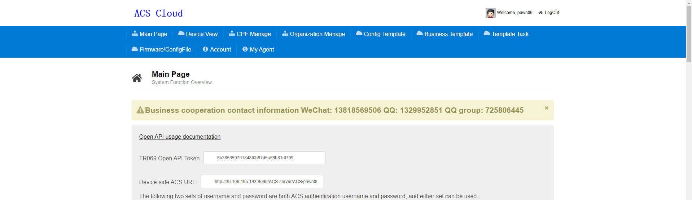
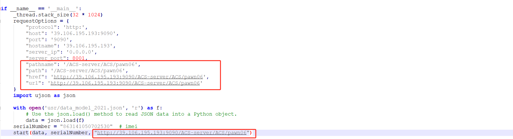
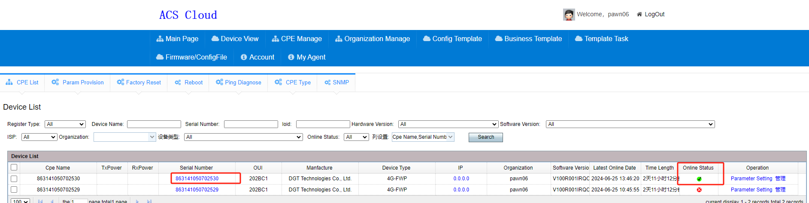

# QuecPython-TR069-CWMP使用说明

此篇文档主要描述TR069和QuecPython的使用介绍文档


## 概述

TR-069是一种用于远程管理和配置设备的协议，通常由互联网服务提供商（ISP）用于管理提供给客户的设备，如路由器、调制解调器和光猫。以下是TR-069的主要功能和使用说明：

1. **设备配置**：首先，设备需要知道ACS（Auto Configuration Server）的URL、ACS的用户名和密码等信息，以便连接到ACS。这些信息通常由ISP提供。
2. **远程管理**：ACS可以远程管理设备，包括配置更改、固件升级、设备重启等操作。这些操作可以通过与设备之间的TR-069通信来执行。
3. **参数查询**：ACS可以查询设备的配置参数和状态信息。这有助于监视设备性能、故障排除和故障诊断。
4. **定期连接**：设备通常会定期连接到ACS，以检查是否有新的配置或指令。这通常是通过定期发送心跳信号或定期执行ACS请求来实现的。
5. **安全性**：TR-069支持安全的通信，通常使用HTTPS协议来保护ACS和设备之间的数据传输。设备和ACS之间的通信可以使用用户名和密码进行身份验证，以确保安全性。
6. **事件通知**：设备可以向ACS发送事件通知，例如错误报告、警报和状态更改。ACS可以订阅这些事件，以便及时采取适当的措施。
7. **配置文件**：ACS可以向设备发送配置文件，以便设备自动进行相应的设置。这包括网络设置、端口映射、防火墙规则等。
8. **设备识别**：TR-069协议使用CPE（Customer Premises Equipment）标识符来唯一标识设备，通常是设备的序列号或其他唯一标识符。

总的来说，TR-069协议提供了一种标准化的方式来远程管理和配置设备，使ISP能够更轻松地管理大量设备，同时也为终端用户提供了更好的服务和支持。使用TR-069需要设备和ACS之间的合适配置和通信，以确保正常运行。


## 组成   

TR-069（Technical Report 069）是一个包含多个组成部分的协议，它定义了用于远程管理和配置设备的框架和规范。以下是TR-069的一些主要组成部分：

1. **CPE（Customer Premises Equipment）**：CPE指的是位于客户设备或用户家庭的设备，如路由器、调制解调器、光猫等。CPE是TR-069的管理对象，即需要远程管理和配置的设备。
2. **ACS（Auto Configuration Server）**：ACS是TR-069的服务器端组件，通常由互联网服务提供商（ISP）或设备制造商托管。ACS用于远程管理CPE，包括配置、升级、监控和故障排除等操作。
3. **CWMP（CPE WAN Management Protocol）**：CWMP是TR-069协议中的通信协议，定义了CPE与ACS之间的通信规范。它规定了消息格式、方法调用、通知和数据模型等方面的细节。
4. **数据模型**：TR-069定义了一组数据模型，用于描述CPE的参数和配置。这些数据模型组织了设备的信息，允许ACS查询和配置设备的各种属性。
5. **RPC（Remote Procedure Call）**：TR-069使用RPC来执行远程方法调用，使ACS能够与CPE交互。通过RPC，ACS可以向CPE发送命令，例如配置更改、固件升级和参数查询。
6. **安全性**：TR-069协议关注通信的安全性。通常，TR-069通信是通过HTTPS协议进行加密的，以确保数据的机密性和完整性。另外，设备和ACS之间的通信可能需要身份验证，以确保通信的合法性。
7. **事件通知**：TR-069支持设备向ACS发送事件通知，包括错误报告、状态更改和警报。ACS可以订阅这些事件以及时响应。
8. **配置文件**：ACS可以向CPE发送配置文件，以便设备自动进行相应的设置。这使得在大规模部署中更容易实现一致性配置。

TR-069是一个复杂的协议，包含多个组成部分，用于实现设备的远程管理和配置。它允许ISP和设备制造商有效地管理大量设备，提供更好的服务和支持，并确保设备的性能和安全性。

**Quecpython**版本的**TR069**主要结合了, 目前主要结合了**CWMP**和**RPC**可定制的功能, 以满足客户, 需求, 客户只需要注册对应的时间处理即可处理对应的**RPC**事件. 来参与**ACS**与**CPE**之间的业务交互, 同时我们支持**TR069**端侧**Server**模式, 而不再是单纯的**Client**来解决事件的循环通知


## 运行

### ACS平台注册

注册ACS平台

>  http://39.106.195.193:9090/acscloud/index.newinit.action


### 获取平台信息



### 请求配置

配置**main.py**中的启动参数



**requestOptions配置说明**

主要用于配置

| 属性名      | 示例值                                           | 说明                                                         |
| ----------- | ------------------------------------------------ | ------------------------------------------------------------ |
| protocol    | http                                             | URL的协议（http或https）                                     |
| host        | 39.106.195.193:9090                              | URL的主机部分，包括主机名和端口号                            |
| port        | 9090                                             | URL的端口号                                                  |
| hostname    | 39.106.195.193                                   | 主机名（不包括端口号）                                       |
| server_ip   | 0.0.0.0                                          | 服务器的IP地址(固定)                                         |
| server_port | 8001                                             | 服务器的端口号(可配置)                                       |
| pathname    | /ACS-server/ACS/pawn06                           | URL的路径部分 (ACS的服务器的资源地址)<br>例如: http://39.106.195.193:9090/ACS-server/ACS/pawn06的资源地址是<br>/ACS-server/ACS/pawn06 |
| path        | /ACS-server/ACS/pawn06                           | URL的路径部分(与pathname相同）                               |
| href        | http://39.106.195.193:9090/ACS-server/ACS/pawn06 | 完整的URL，包括协议、主机、端口和路径部分                    |
| url         | http://39.106.195.193:9090/ACS-server/ACS/pawn06 | 完整的URL，包括协议、主机、端口和路径部分                    |

示例:

```json
{
    "protocol": 'http:',
    "host": '39.106.195.193:9090',
    "port": '9090',
    "hostname": '39.106.195.193',
    "server_ip": '0.0.0.0',
    "server_port": 8001,
    "pathname": '/ACS-server/ACS/pawn06',
    "path": '/ACS-server/ACS/pawn06',
    "href": 'http://39.106.195.193:9090/ACS-server/ACS/pawn06',
    "url": 'http://39.106.195.193:9090/ACS-server/ACS/pawn06'
}
```

**配置序列号**

序列号在CPE的作用就等于是个名称, 一般采用**IMEI**代替

**启动业务**

代码下载到模组中运行，即可完成完整的CPE启动过程, 平台上可以从设备管理上看到设备在线状态




